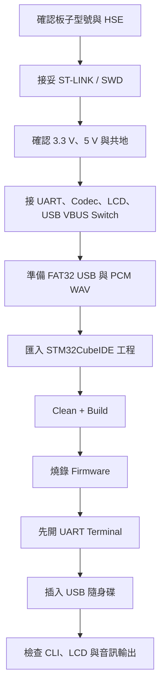
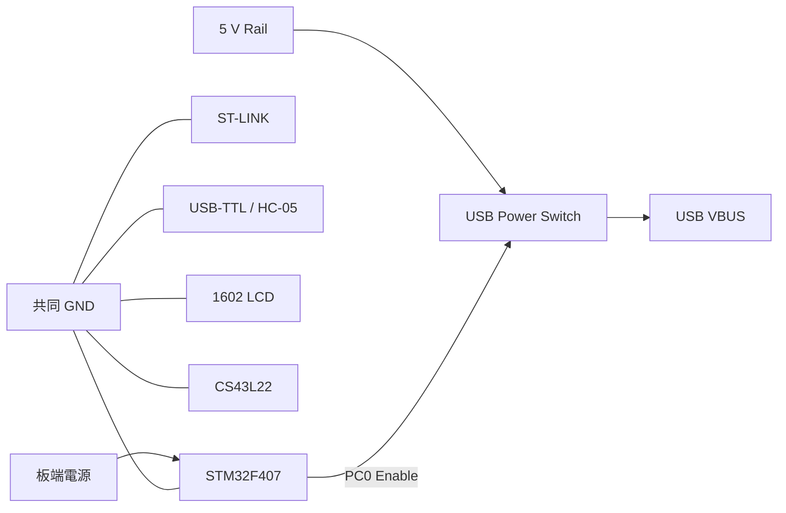
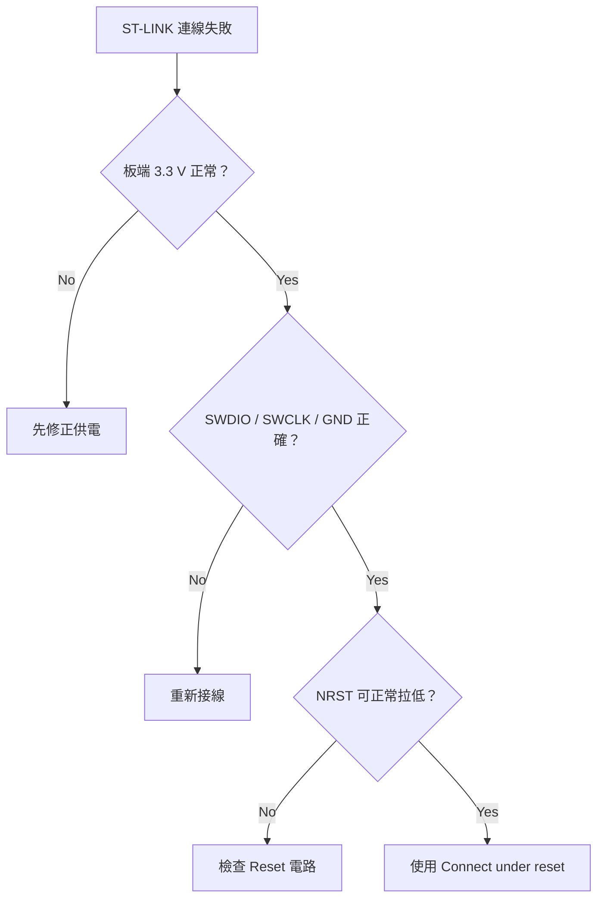
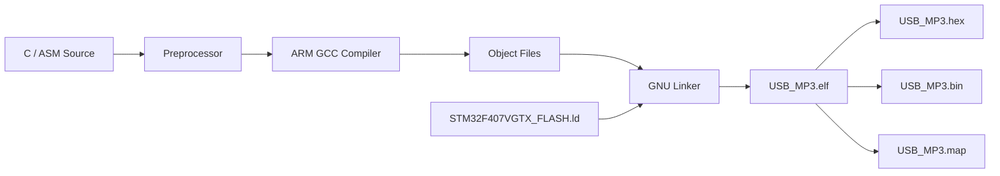
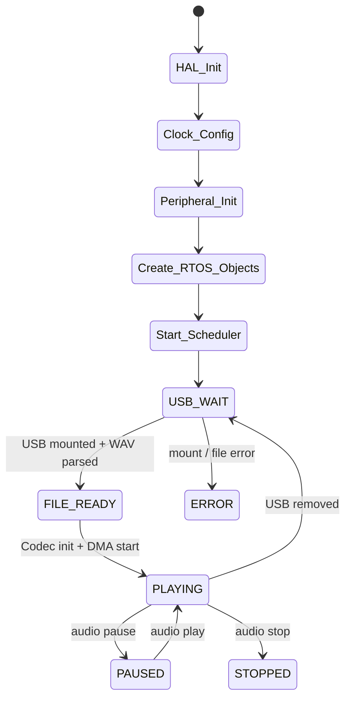
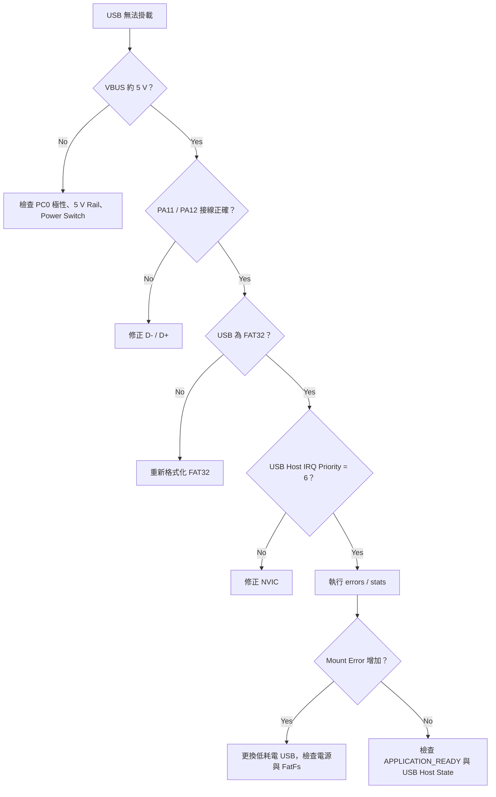
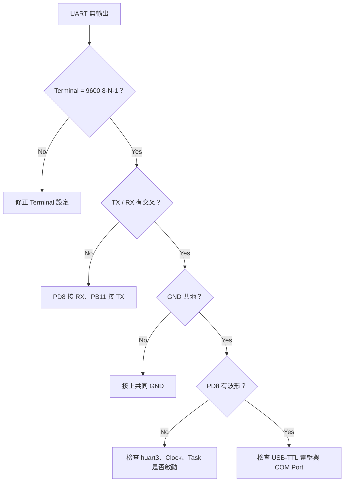
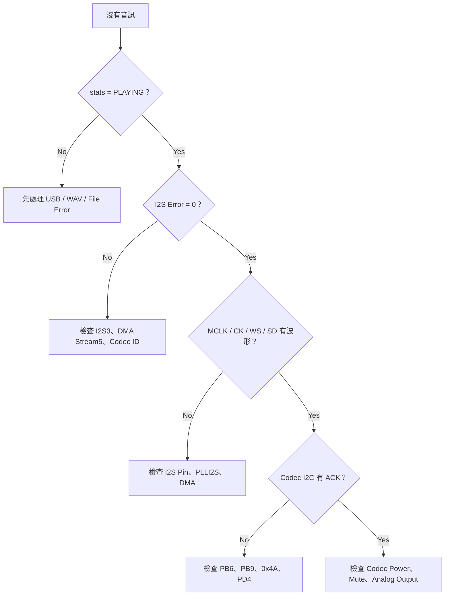

# STM32F407 USB Audio 建置與板端設定

內容依 repository 內的 `.ioc`、HAL 初始化程式與 application modules
整理。工程格式、MCU 型號與時脈數值取自現有設定檔；板端電壓、時序與音訊
輸出仍需量測確認。

---

## 1. 操作順序

先完成供電與 SWD，再處理 USB、UART、Audio Codec 與 LCD。硬體接線確認
後再燒錄韌體，可降低 USB VBUS 極性或外部模組電壓接錯的風險。



### 圖例

| 圖示文字 | 意義 |
|---|---|
| Build | 編譯與連結（Compile / Link） |
| Flash | 透過 SWD 將程式寫入 MCU Flash |
| Bring-up | 板端上電後逐項確認時脈、周邊與訊號 |
| Checkpoint | 進入下一步前應確認的結果 |

---

## 2. 軟體與工具

### 2.1 必要工具

- STM32CubeIDE
- STM32CubeF4 Firmware Package 1.27.x
- ST-LINK 或相容 SWD Programmer
- 3.3 V USB-TTL Serial Adapter
- 可開啟 Serial Port 的 Terminal
- FAT32 USB 隨身碟

音檔轉換可使用 FFmpeg。量測訊號時可搭配：

- Digital Multimeter
- Oscilloscope
- Logic Analyzer

### 2.2 版本資訊

`.ioc` 記錄的產生環境：

| 項目 | 版本 |
|---|---|
| STM32CubeMX | 6.7.0 |
| STM32CubeF4 | 1.27.1 |
| Target Toolchain | STM32CubeIDE |
| MCU | STM32F407VGTx |

較新的 CubeMX 可能要求 migration。若只建置現有程式碼，不需要先由
CubeMX 重新產生檔案；若要修改 `.ioc`，先備份並檢查 migration 差異。

---

## 3. 工程資料夾

| 路徑 | 內容 |
|---|---|
| `Core/Inc` | Application 與 HAL Header |
| `Core/Src` | Tasks、Services、Drivers、HAL 初始化 |
| `USB_HOST` | USB Host MSC 與 Board Support |
| `FATFS` | FatFs Application 與 Disk I/O |
| `Middlewares/ST` | STM32 USB Host Library |
| `Middlewares/Third_Party/FreeRTOS` | FreeRTOS Kernel 10.3.1 |
| `Middlewares/Third_Party/FatFs` | FatFs Library |
| `tools/build_firmware.ps1` | GNU Arm 命令列建置 |
| `USB_MP3.ioc` | CubeMX Peripheral 設定 |

Application modules：

| 檔案 | 責任 |
|---|---|
| `app_main.c` | 建立 RTOS objects 與啟動 Scheduler |
| `app_tasks.c` | 六個 Tasks 與 PA0 EXTI callback |
| `audio_service.c` | 播放狀態、WAV parser、DMA buffer |
| `control_service.c` | System Command Queue |
| `cli_service.c` | UART RX、Parser、Command Table |
| `diagnostics.c` | Counter、Heap、Stack、Heartbeat、IWDG |
| `system_events.c` | FreeRTOS Event Group |

---

## 4. 供電與共地

板子、ST-LINK、USB-TTL、LCD、HC-05 與外接 codec 必須共地。訊號線接妥
但沒有共地時，UART、I2C 與 I2S 都可能出現不穩定或完全無回應。



### 4.1 USB VBUS 注意事項

PC0 是 power switch enable，不是 USB 5 V 輸出。STM32 GPIO 不可直接供電
給 USB 隨身碟。

外部電路應包含：

- 5 V 電源
- High-side Power Switch 或具限流能力的 Load Switch
- Over-current Protection
- 足夠的輸出電容

接上隨身碟前，先量 USB connector 的 VBUS：

| 狀態 | 預期 |
|---|---|
| Host 關閉 | 接近 0 V |
| Host 啟用 | 接近 5 V |

`MX_DriverVbusFS()` 採 active-low enable：

- PC0 Low：開啟 VBUS
- PC0 High：關閉 VBUS

若板上的 power switch 是 active-high，需修改
`USB_HOST/Target/usbh_platform.c`。

---

## 5. SWD 與 ST-LINK

### 5.1 接線

| ST-LINK | STM32F407 | 說明 |
|---|---|---|
| SWDIO | PA13 | Serial Wire Data |
| SWCLK | PA14 | Serial Wire Clock |
| NRST | NRST | Reset |
| GND | GND | Ground |
| VTref | 3.3 V | Target Voltage Reference |

VTref 用來讓 debugger 判斷 target I/O voltage。若板子已由外部電源供電，
不要再從 ST-LINK 的 3.3 V 輸出強制供電，除非已確認兩邊電源架構允許。

### 5.2 連線檢查

ST-LINK 無法連線時依序檢查：

1. 板端 3.3 V 是否正常。
2. GND 是否共地。
3. SWDIO、SWCLK 是否接反。
4. NRST 是否被外部電路拉住。
5. Boot0 是否維持正常啟動設定。
6. CubeIDE Debug Configuration 是否選對 Probe。
7. 必要時改成 `Connect under reset`。



---

## 6. 周邊接線

### 6.1 CS43L22 Audio Codec

| 功能 | STM32F407 | Peripheral |
|---|---|---|
| Codec I2C SCL | PB6 | I2C1_SCL |
| Codec I2C SDA | PB9 | I2C1_SDA |
| Codec Reset | PD4 | GPIO Output |
| Word Select / LRCK | PA4 | I2S3_WS |
| Master Clock | PC7 | I2S3_MCK |
| Bit Clock | PC10 | I2S3_CK |
| Serial Data | PC12 | I2S3_SD |

Codec I2C 7-bit address 為 `0x4A`。STM32 HAL 傳入左移一位後的 address，
因此程式中的 `AUDIO_I2C_ADDRESS` 是 `0x94`。

I2S 格式：

| 項目 | 設定 |
|---|---|
| Role | Master Transmit |
| Standard | Philips I2S |
| Data Width | 16-bit |
| Channel | Stereo |
| MCLK | Enabled |
| Clock Polarity | Low |

使用外接 codec module 時，需另外核對 analog power、digital power、
headphone output、speaker amplifier 與 module 的 MCLK 要求。I2S 數位腳位
接對，不代表 analog output 一定能直接驅動喇叭。

### 6.2 USB OTG FS Host

| 功能 | STM32F407 |
|---|---|
| USB D- | PA11 |
| USB D+ | PA12 |
| VBUS Sense | PA9 |
| VBUS Switch Enable | PC0 |

USB D+、D- 應保持差動對走線，避免過長飛線、分支與大面積迴路。若使用
自製板，還要確認 ESD protection、connector shield 與 VBUS decoupling。

### 6.3 USART3 CLI / HC-05

| 功能 | STM32F407 | 外接端 |
|---|---|---|
| USART3_RX | PB11 | USB-TTL TX / HC-05 TXD |
| USART3_TX | PD8 | USB-TTL RX / HC-05 RXD |
| GND | GND | GND |

Serial format：

```text
9600 baud
8 data bits
No parity
1 stop bit
No flow control
```

UART 是交叉接線：MCU RX 接對方 TX，MCU TX 接對方 RX。

HC-05 module 的供電與 RXD 耐壓依 breakout board 而異。VCC 可接受 5 V
不代表 RXD 一定可接受 5 V logic；不確定時使用 level shifter 或分壓。

### 6.4 1602 LCD / PCF8574

| 功能 | STM32F407 |
|---|---|
| I2C3_SCL | PA8 |
| I2C3_SDA | PC9 |

韌體會偵測：

| PCF8574 7-bit Address | STM32 HAL Address |
|---:|---:|
| `0x27` | `0x4E` |
| `0x3F` | `0x7E` |

預設 backpack mapping：

| PCF8574 Pin | LCD Signal |
|---|---|
| P0 | RS |
| P2 | EN |
| P3 | Backlight |
| P4～P7 | D4～D7 |

若 I2C 掃描得到 ACK，但 LCD 沒有文字，優先調整對比電位器，再核對 backpack
mapping。部分模組的 SDA/SCL pull-up 連到 5 V，使用前需確認電壓。

### 6.5 Button 與 LED

| 功能 | 腳位 | 設定 |
|---|---|---|
| User Button | PA0 | Rising-edge EXTI、Pull-down |
| LED | PD12～PD15 | Push-pull Output |

PA0 觸發後送出 `CMD_NEXT`。Fatal error 時，PD15 亮起，PD12～PD14 關閉。

---

## 7. 準備 USB 隨身碟與音檔

### 7.1 USB 格式化

建議使用 FAT32：

1. 備份隨身碟內原有資料。
2. 在作業系統中選擇格式化。
3. File System 選 FAT32。
4. Allocation Unit Size 使用預設值。
5. 完成後重新插拔一次。

韌體只掃描根目錄，最多列出 24 個 WAV 檔案。檔名緩衝區為 64 bytes，
檔名應控制在 63 bytes 內。

### 7.2 音檔轉換

FFmpeg：

```powershell
ffmpeg -i input.mp3 -ac 2 -ar 44100 -c:a pcm_s16le output.wav
```

參數：

| 參數 | 意義 |
|---|---|
| `-ac 2` | Stereo |
| `-ar 44100` | 44.1 kHz Sample Rate |
| `-c:a pcm_s16le` | 16-bit Little-endian PCM |

目前 parser 與 I2S clock mapping 列出的 sample rates：

```text
8000
11025
16000
22050
32000
44100
48000
96000
```

初次板端測試可先放兩個 44.1 kHz、16-bit Stereo WAV；基本播放確認後，
再測其他 sample rate。

---

## 8. STM32CubeIDE 匯入與建置

### 8.1 匯入

1. 開啟 STM32CubeIDE。
2. 選 `File > Import...`。
3. 展開 `General`。
4. 選 `Existing Projects into Workspace`。
5. 按 `Next`。
6. `Select root directory` 指到 repository 的 `USB_MP3` 資料夾。
7. 清單中應出現 `USB_MP3`。
8. `Copy projects into workspace` 保持未勾選。
9. 按 `Finish`。

若 Project Explorer 沒出現工程，確認所選資料夾內是否有 `.project` 與
`.cproject`。

### 8.2 Clean 專案

1. 對 `USB_MP3` 按右鍵。
2. 選 `Refresh`。
3. 選 `Project > Clean...`。
4. 勾選 `USB_MP3`。
5. 執行 Clean。

Clean 會讓 CubeIDE 重新產生 Managed Build makefiles，並納入新增的
application 與 FreeRTOS source。

### 8.3 Build Configuration

Debug：

- Optimization 較低
- 保留 Debug symbols
- 適合 breakpoint、watch window 與 stack 檢查

Release：

- 使用較高 optimization
- Flash 使用量較低
- 板端功能確認後再用於長時間測試

設定方式：

1. 專案按右鍵。
2. 選 `Build Configurations > Set Active`。
3. 選 `Debug` 或 `Release`。
4. 執行 `Project > Build Project`。

### 8.4 建置輸出

Debug：

```text
Debug/USB_MP3.elf
Debug/USB_MP3.hex
Debug/USB_MP3.bin
Debug/USB_MP3.map
```

Release：

```text
Release/USB_MP3.elf
Release/USB_MP3.hex
Release/USB_MP3.bin
Release/USB_MP3.map
```

### 8.5 Build 流程



### 8.6 常見 Build 錯誤

#### 找不到 `FreeRTOS.h`

檢查 include paths：

```text
Middlewares/Third_Party/FreeRTOS/Source/include
Middlewares/Third_Party/FreeRTOS/Source/portable/GCC/ARM_CM4F
```

#### 找不到 `portmacro.h`

確認使用 `ARM_CM4F` port，MCU compiler options 應包含：

```text
-mcpu=cortex-m4
-mfpu=fpv4-sp-d16
-mfloat-abi=hard
```

#### 重複定義 `SVC_Handler` 或 `PendSV_Handler`

通常代表 CubeMX 又產生一份 FreeRTOS，或同時編入兩個 port。工程只保留：

```text
Middlewares/Third_Party/FreeRTOS/Source/portable/GCC/ARM_CM4F/port.c
```

#### 找不到新加入的 `.c`

先執行 `Refresh`、`Clean`，再確認該資料夾沒有設為
`Exclude from Build`。

---

## 9. 命令列建置

GNU Arm Embedded Toolchain 的 `bin` 目錄需在 `PATH`。

確認：

```powershell
arm-none-eabi-gcc --version
```

Debug：

```powershell
powershell -ExecutionPolicy Bypass -File .\tools\build_firmware.ps1 `
  -Configuration Debug `
  -OutputDirectory build-cli-debug
```

Release：

```powershell
powershell -ExecutionPolicy Bypass -File .\tools\build_firmware.ps1 `
  -Configuration Release `
  -OutputDirectory build-cli-release
```

Script 會：

1. 檢查 compiler。
2. 建立指定的 output directory。
3. 編譯 HAL、USB Host、FatFs、FreeRTOS 與 application sources。
4. 編譯 startup assembly。
5. 使用 Flash linker script 連結。
6. 執行 `arm-none-eabi-size`。

---

## 10. 燒錄與執行

### 10.1 建立 Debug Configuration

1. 選 `Run > Debug Configurations...`。
2. 選 `STM32 Cortex-M C/C++ Application`。
3. 選 repository 內的 `USB_MP3.launch`，或建立新設定。
4. Project 選 `USB_MP3`。
5. Application 選 `Debug/USB_MP3.elf`。
6. Debug Probe 選實際使用的 ST-LINK。
7. Interface 選 SWD。
8. Reset Mode 優先使用 `Software system reset`；連線困難時改用
   `Connect under reset`。
9. 按 `Apply`。
10. 按 `Debug`。

### 10.2 開始執行

Debugger 通常會停在 `main()`：

1. 先確認 `SystemClock_Config()` 沒有進入 `Error_Handler()`。
2. 按 `Resume`。
3. 開啟 UART Terminal。
4. 按板端 Reset。

依 `cli_service.c` 的啟動字串，UART 預期顯示：

```text
FreeRTOS USB Audio Player CLI
Type 'help' for commands.
>
```

沒有看到訊息時，先不要插 USB，依第 18 節的 UART 排查流程處理。

---

## 11. 上電檢查

依序確認，不要同時接上所有模組後才查問題。

### Checkpoint A：CPU 與 UART

1. 只接 ST-LINK、板端電源、USB-TTL。
2. 燒錄 Debug firmware。
3. Reset。
4. 確認 UART 顯示 CLI banner。
5. 輸入 `help`。
6. 輸入 `tasks`。
7. 輸入 `heap`。

### Checkpoint B：LCD

1. 關閉板端電源。
2. 接上 I2C3 LCD。
3. 重新上電。
4. 確認 LCD 顯示 `RTOS USB AUDIO` 或播放狀態。

LCD 失敗不會阻止 AudioTask 與 FileTask 執行，可先透過 CLI 繼續確認。

### Checkpoint C：Codec

1. 接妥 I2C1、I2S3、PD4 與 codec power。
2. 重新上電。
3. 尚未插 USB 時，執行 `errors`。
4. 確認 I2S error 未持續增加。

### Checkpoint D：USB Host

1. 先量測 VBUS。
2. 插入 FAT32 隨身碟。
3. 執行 `stats`。
4. 確認狀態由 `USB_WAIT` 進入 `FILE_READY` 或 `PLAYING`。
5. 執行 `errors`，確認 USB Mount Errors 沒有增加。

### 開機流程



---

## 12. UART CLI 操作

Terminal：

```text
Baud Rate  : 9600
Data Bits  : 8
Parity     : None
Stop Bits  : 1
Flow Ctrl  : None
Line Ending: CRLF 或 LF
```

### 12.1 指令表

| 指令 | 作用 |
|---|---|
| `help` | 列出指令 |
| `tasks` | 顯示 Task state、priority、stack |
| `heap` | 顯示 Free Heap 與 Minimum Ever Free Heap |
| `stats` | 顯示系統與播放摘要 |
| `audio play` | 開始或繼續播放 |
| `audio pause` | 暫停 |
| `audio stop` | 停止 |
| `audio next` | 下一首 |
| `audio prev` | 上一首 |
| `volume up` | 音量增加 10 |
| `volume down` | 音量減少 10 |
| `volume set N` | 設定 0～100 |
| `watchdog` | 顯示 Watchdog 與 Task Health |
| `buffers` | 顯示 Audio Buffer generation 與 Queue usage |
| `errors` | 顯示錯誤計數 |
| `reset_stats` | 清除錯誤計數 |

### 12.2 `tasks` 欄位

| State | 意義 |
|---|---|
| X | Running |
| R | Ready |
| B | Blocked |
| S | Suspended |
| D | Deleted |

Stack 是 `uxTaskGetStackHighWaterMark()` 的結果，單位為 words。數值越小，
代表歷史最低剩餘 stack 越少。

### 12.3 記錄項目

長時間播放前後各執行一次：

```text
heap
tasks
stats
buffers
errors
```

比較：

- Minimum Ever Free Heap 是否持續下降
- Stack High Water Mark 是否接近 0
- Audio Underrun 是否增加
- File Read Error 是否增加
- Queue Full 是否出現

---

## 13. CubeMX 周邊設定

repository 目前包含 generated code。命令列建置紀錄見 README；若要由
CubeMX 重建 `.ioc`、更換 MCU 或改腳位，再依本節逐項核對。

### 13.1 Pinout


主要腳位：

```text
PA0   Button EXTI
PA4   I2S3_WS
PA8   I2C3_SCL
PA9   USB VBUS Sense
PA11  USB DM
PA12  USB DP
PB6   I2C1_SCL
PB9   I2C1_SDA
PB11  USART3_RX
PC0   USB VBUS Switch Enable
PC7   I2S3_MCK
PC9   I2C3_SDA
PC10  I2S3_CK
PC12  I2S3_SD
PD4   Codec Reset
PD8   USART3_TX
PD12～PD15 LED
```

### 13.2 Clock Tree


Clock Configuration：

| 項目 | 數值 |
|---|---:|
| HSE | 8 MHz |
| PLLM | 8 |
| PLLN | 192 |
| PLLP | 2 |
| PLLQ | 4 |
| SYSCLK | 96 MHz |
| AHB | 96 MHz |
| APB1 | 24 MHz |
| APB2 | 48 MHz |
| USB Clock | 48 MHz |

USB FS 必須取得準確的 48 MHz clock。Clock Configuration 頁面若顯示 USB
clock error，先修正 PLLQ，再處理其他周邊。

### 13.3 DMA


I2S3 TX：

| 設定 | 數值 |
|---|---|
| Stream | DMA1 Stream5 |
| Channel | 0 |
| Direction | Memory to Peripheral |
| Mode | Circular |
| Priority | High |
| Peripheral Alignment | Half Word |
| Memory Alignment | Half Word |
| Memory Increment | Enabled |
| FIFO | Enabled |
| FIFO Threshold | Full |

USART3 RX：

| 設定 | 數值 |
|---|---|
| Stream | DMA1 Stream1 |
| Channel | 4 |
| Direction | Peripheral to Memory |
| Mode | Normal |
| Alignment | Byte |
| Priority | Low |

USART3 TX：

| 設定 | 數值 |
|---|---|
| Stream | DMA1 Stream3 |
| Channel | 4 |
| Direction | Memory to Peripheral |
| Mode | Normal |
| Alignment | Byte |
| Priority | Low |

### 13.4 GPIO


- PA0：External Interrupt Mode with Rising Edge、Pull-down
- PC0：GPIO Output
- PD12～PD15：GPIO Output

### 13.5 I2C1


- Clock Speed：100 kHz
- Addressing Mode：7-bit
- PB6：SCL
- PB9：SDA

### 13.6 I2C3


- Clock Speed：100 kHz
- Addressing Mode：7-bit
- PA8：SCL
- PC9：SDA
- Event IRQ Priority：8
- Error IRQ Priority：8

### 13.7 USART3


- Mode：Asynchronous
- Baud Rate：9600
- Word Length：8 Bits
- Parity：None
- Stop Bits：1
- RX：PB11
- TX：PD8

### 13.8 USB OTG FS


- Mode：Host Only
- PHY：Embedded
- VBUS Sensing：Enabled
- OTG FS IRQ Priority：6

### 13.9 I2S3


- Mode：Master Transmit
- Standard：Philips
- Data Format：16-bit
- MCLK Output：Enabled
- Full Duplex：Disabled
- DMA1 Stream5 Circular

韌體會依 WAV sample rate 套用對應的 PLLI2SN / PLLI2SR，再重新初始化 I2S。

### 13.10 FatFs


- Disk I/O：USB
- Long File Name：Enabled

### 13.11 USB Host MSC


- Class：MSC
- Interface：Full Speed

### 13.12 NVIC


| IRQ | Preemption Priority |
|---|---:|
| DMA1 Stream5 / I2S TX | 6 |
| OTG FS | 6 |
| DMA1 Stream1 / USART3 RX | 7 |
| DMA1 Stream3 / USART3 TX | 7 |
| USART3 | 7 |
| EXTI0 | 7 |
| I2C3 Event | 8 |
| I2C3 Error | 8 |
| SysTick | 15 |

`configLIBRARY_MAX_SYSCALL_INTERRUPT_PRIORITY` 是 5。會呼叫 FreeRTOS
FromISR API 的 IRQ 不可設為 0～4。

---

## 14. FreeRTOS 整合

Kernel 路徑：

```text
Middlewares/Third_Party/FreeRTOS/Source
```

Port：

```text
portable/GCC/ARM_CM4F
```

Heap：

```text
portable/MemMang/heap_4.c
```

目前 `.ioc` 沒有啟用 CubeMX FreeRTOS Middleware；工程直接編入 repository
內的 FreeRTOS Kernel。

### 14.1 CubeMX 重新產生後要檢查

1. `SysTick_Handler()` 仍同時呼叫 `HAL_IncTick()` 與
   `xPortSysTickHandler()`。
2. `SVC_Handler`、`PendSV_Handler` 沒有重複定義。
3. `USBH_Delay()` 在 scheduler 啟動後使用 `vTaskDelay()`。
4. IRQ priorities 沒有被改回 0。
5. I2S TX DMA 仍為 Circular Mode。
6. USART3 RX DMA 仍為 Normal Mode。
7. FreeRTOS include paths 仍存在。
8. `heap_4.c` 仍有編入。

### 14.2 改用 CMSIS-RTOS v2

若改成 CubeMX 管理的 CMSIS-RTOS v2，需同步調整：

1. 備份可編譯版本。
2. CubeMX 啟用 FreeRTOS、Interface 選 CMSIS_V2。
3. HAL Timebase 改用 TIM6 或其他未使用 timer。
4. 移除 repository 內重複的 Kernel sources。
5. 合併 `FreeRTOSConfig.h`。
6. 將 object 與 task 建立接到 `MX_FREERTOS_Init()`。
7. 保留 services 的責任分工。
8. 重做 Debug 與 Release build。
9. 重測 UART RX、I2S DMA、USB mount 與 Watchdog。

---

## 15. IWDG

預設：

```c
#define ENABLE_IWDG_MONITOR 0
```

啟用方式：

1. 開啟 `Project Properties`。
2. 選 `C/C++ Build > Settings`。
3. 選 `MCU GCC Compiler > Preprocessor`。
4. 在 Defined Symbols 加入：

```text
ENABLE_IWDG_MONITOR=1
```

5. Debug 與 Release configuration 分別設定。
6. Clean、Build、重新燒錄。

Watchdog 參數：

| 項目 | 數值 |
|---|---:|
| Clock | LSI，約 32 kHz |
| Prescaler | 64 |
| Reload | 1249 |
| Nominal Timeout | 約 2.5 秒 |

MonitorTask 每秒檢查 heartbeat。只有 AudioTask、FileTask、ControlTask、
UiTask 與 CliTask 都健康時才 refresh IWDG。

Breakpoint 會暫停 CPU，但 IWDG 可能繼續計時。Debug 階段若需要長時間停在
breakpoint，先保持 IWDG 關閉。

---

## 16. 板端驗收項目

### 16.1 基本播放

1. 不插 USB，Reset。
2. 執行 `stats`，記錄是否顯示 `USB_WAIT`。
3. 插入 FAT32 USB。
4. 等待 mount 與 WAV parse。
5. 執行 `stats`，記錄是否進入 `PLAYING`。
6. 確認耳機或喇叭是否有聲音。
7. 執行 `buffers`，確認 generation 是否持續前進。
8. 執行 `errors`，記錄 Audio Underrun 的實際數值。

### 16.2 控制命令

依序執行：

```text
audio pause
audio play
audio next
audio prev
volume set 50
volume up
volume down
audio stop
audio play
```

### 16.3 USB 拔除

1. 播放中拔除 USB。
2. 確認 DMA 是否停止。
3. 確認狀態是否回到 `USB_WAIT`。
4. 再次插入 USB。
5. 確認是否重新 mount。
6. 檢查 `USB Mount Errors` 與 `File Read Errors`。

### 16.4 錯誤輸入

```text
volume set -1
volume set 101
audio unknown
unknown_command
```

預期 CLI 回覆 error。若發生 HardFault 或 Task crash，表示錯誤輸入路徑仍有
問題，需保留 fault register 與輸入內容。

### 16.5 長時間測試

至少記錄：

- Uptime
- Free Heap
- Minimum Ever Free Heap
- 各 Task Stack High Water Mark
- Audio Underrun
- File Read Error
- UART Overflow
- Queue Full
- Watchdog Refresh / Skipped

---

## 17. USB 無法掛載



常見原因：

- VBUS switch 極性相反
- 5 V rail 電流不足
- D+ / D- 接反
- 隨身碟不是 FAT32
- OTG FS 48 MHz clock 不正確
- USB Host process 沒有持續執行

---

## 18. UART 沒有輸出



若 banner 正常但輸入沒反應：

- 檢查 PB11。
- 檢查 DMA1 Stream1 Channel 4。
- 檢查 USART3 IRQ 與 DMA IRQ priority。
- 執行 debugger，觀察 `cli_rx_restart_pending`。
- 檢查 Terminal 是否送出 CR、LF 或 CRLF。

---

## 19. 沒有音訊



示波器檢查順序：

1. PC7 MCLK
2. PC10 Bit Clock
3. PA4 Word Select
4. PC12 Serial Data
5. PB6 / PB9 I2C transaction
6. PD4 Reset

若播放速度或音高不正確，先核對 HSE、PLLM、PLLI2SN、PLLI2SR 與 WAV
sample rate。

---

## 20. LCD 無顯示

1. 確認 VCC、GND。
2. 調整對比電位器。
3. 量測 PA8、PC9 idle level。
4. 確認 address 是 0x27 或 0x3F。
5. 確認 pull-up 電壓。
6. 核對 backpack mapping。

LCD 初始化失敗時，UiTask 仍會持續更新 heartbeat，不會阻止播放。

---

## 21. Diagnostics 判讀

| Counter | 增加時代表 |
|---|---|
| Audio Underrun | FileTask 未在 deadline 前補完 half-buffer |
| File Read Error | FatFs read、WAV parse 或檔案狀態錯誤 |
| UART Rx Error | UART HAL error、DMA restart 失敗或格式錯誤 |
| UART Overflow | Ring buffer 沒有足夠空間 |
| USB Mount Error | Mount 或根目錄掃描失敗 |
| Command Queue Full | Control command 來不及消化 |
| File Queue Full | Refill / Prepare request 堆積 |
| I2S Error | Codec 或 HAL I2S 操作失敗 |
| Watchdog Skipped | 至少一個核心 Task heartbeat 不健康 |

依目前 generation logic，正常播放時預期 `ready_generation` 跟上
`half_generation`。若持續出現落差且 Audio Underrun 增加，需量測
FileTask latency、USB 供電與隨身碟讀取時間，再評估是否調整 buffer size。

---

## 22. 程式複查紀錄

目前原始碼可確認的調整：

1. USB Host delay 在 Scheduler 啟動後改用 `vTaskDelay()`。
2. LCD 備用 HAL address 修正為 `0x7E`。
3. UART Error ISR 只設 recovery flag，由 CliTask 重啟 DMA。
4. `tasks` 改用固定 `TaskStatus_t` 陣列，不在 runtime 配置記憶體。
5. WAV parser 檢查 RIFF chunk boundary、PCM format、channel、bit depth、
   sample rate 與 frame alignment。
6. Stream session 防止切歌後舊 `f_read()` 提交資料。
7. USB 掃描失敗會清除清單並 unmount。
8. Codec 與 I2S HAL return status 已納入錯誤處理。
9. `Appli_state` 改為 `volatile`，符合 USB callback 與 FileTask 的共享方式。
10. I2S clock selection 改為依 sample rate 套用 PLLI2S mapping table。
11. FileTask 改為在 `MX_USB_HOST_Process()` 後讀取連線狀態；根目錄掃描中
    若偵測到拔除，會丟棄部分檔案清單並回傳 `FR_NOT_READY`。
12. DMA half、complete 與 error 改用 `AudioDma Queue` 傳遞，避免相同
    notification bit 合併後漏掉 refill boundary。
13. FileTask commit 前檢查 DMA `NDTR` 與安全餘量；逾時讀取仍會同步
    `data_remaining`，避免檔尾誤判成 short read。
14. UART binary frame 加入 250 ms timeout，restart flag 改為 atomic
    test-and-clear，避免錯誤復原事件遺失。
15. CS43L22 I2C timeout 由約 41 秒縮短為 100 ms，失敗後重設 I2C 並重試
    一次；寫入錯誤會回傳到 AudioTask。
16. I2C1 使用 blocking transfer，不再開啟缺少 handler 的 I2C1 EV/ER IRQ。
17. HD44780 上電切換 4-bit mode 時改為只送 high nibble；LCD I2C 傳輸
    失敗後會停止後續更新，避免 UiTask 反覆等待 timeout。
18. 過長 WAV 檔名不再截短後嘗試開檔；PA0 按鍵加入 150 ms debounce。

仍需實機量測：

- USB VBUS switch 極性與 5 V 電流
- HSE 實際頻率
- I2S clocks 與 sample rate 誤差
- CS43L22 analog output
- LCD backpack mapping
- 不同 USB 隨身碟的 worst-case read latency
- LSI 誤差與 IWDG timeout
