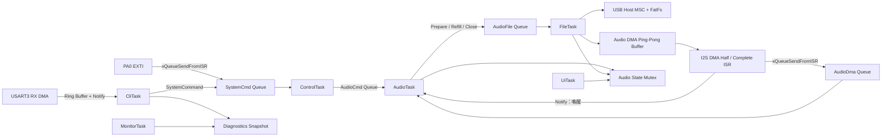

# FreeRTOS USB Audio 系統架構

## 1. 設計範圍

目前架構將原本單一 while-loop 的 USB WAV player 拆成六個 FreeRTOS
Tasks，並保留既有 STM32 HAL、USB Host MSC、FatFs、CS43L22、I2S3 DMA、
USART3 與 LCD driver。

設計重點：

- Audio DMA callback 不讀檔、不解析指令、不更新 LCD。
- FatFs 操作集中在 FileTask。
- 所有控制來源都先轉成 `SystemCommand`。
- Watchdog 只由 MonitorTask refresh。
- Runtime counter 集中放在 diagnostics module。
- Application 播放路徑不直接呼叫一般 `malloc()` / `free()`；USB Host
  class 啟用或移除時仍可能透過 `pvPortMalloc()` / `vPortFree()` 配置資料。

---

## 2. Task 配置

| Task | Priority | Stack | 工作內容 |
|---|---:|---:|---|
| AudioTask | 5 | 512 words | 播放狀態、codec、I2S DMA event、underrun 處理 |
| FileTask | 4 | 768 words | USB Host process、mount、WAV parser、FatFs refill |
| ControlTask | 3 | 384 words | 統一接收 CLI、Bluetooth、Button command |
| CliTask | 3 | 768 words | UART Receive-to-Idle DMA、ring buffer、command parser |
| MonitorTask | 2 | 512 words | Heap、stack、heartbeat、queue 與 Watchdog policy |
| UiTask | 1 | 384 words | 每 500 ms 更新 1602 LCD |

Stack 數值是 FreeRTOS `StackType_t` words，不是 bytes。STM32F407 的
`StackType_t` 為 32-bit，因此 512 words 等於 2048 bytes。

---

## 3. Task 間資料流



---

## 4. RTOS Objects

### SystemCmd Queue

來源：

- CliTask
- PA0 EXTI callback
- 舊版 Bluetooth binary frame

接收者：

- ControlTask

內容：

```c
typedef struct {
  SystemCommandType type;
  int32_t value;
} SystemCommand;
```

### AudioCmd Queue

ControlTask 將 command 轉送給 AudioTask。AudioTask 是唯一會執行播放狀態
切換與 codec control 的 Task，避免多個 Task 同時呼叫 audio driver。

### AudioFile Queue

AudioTask 送出：

- `PREPARE`
- `REFILL`
- `CLOSE`

FileTask 是唯一執行 FatFs `f_open()`、`f_read()`、`f_close()` 的 Task。

### AudioDma Queue

DMA half-complete、complete 與 error event 先放入 `AudioDma Queue`，再以
Task Notification 喚醒 AudioTask。Queue 會保留事件的次數與順序，避免
同類 notification bit 在 AudioTask 延遲時合併。

### Direct Task Notification

I2S DMA callback 使用 `xTaskNotifyFromISR()` 喚醒 AudioTask，實際事件內容
由 `AudioDma Queue` 傳遞。ISR 不做 buffer refill。

FileTask 準備好新檔案後，也用 notification 通知 AudioTask。

### Mutex

`audio_state_mutex` 保護：

- Audio state
- Current song
- Volume
- USB mounted / file prepared
- DMA active
- Buffer generation
- Stream session

CLI 與 UI 只讀 snapshot，不直接操作內部 context。

### Event Group

目前 bits：

- USB connected
- USB mounted
- File ready
- Playing
- Paused
- Error

Event Group 用來表示系統狀態，不拿來傳送帶參數的 command。

---

## 5. Audio DMA Ping-Pong Buffer

```text
audio_dma_buffer[4096 bytes]
├─ Half 0: 2048 bytes
└─ Half 1: 2048 bytes
```

44.1 kHz、16-bit stereo 時：

- 每個 stereo frame 為 4 bytes。
- 每個 half-buffer 為 512 frames。
- 每次 refill deadline 約 11.6 ms。

流程：

1. DMA 播放 Half 0。
2. Half-complete ISR 將事件放入 AudioDma Queue，並喚醒 AudioTask。
3. DMA 開始播放 Half 1。
4. AudioTask 請 FileTask refill Half 0。
5. Complete ISR 將事件放入 AudioDma Queue，並喚醒 AudioTask。
6. DMA 回到 Half 0。
7. AudioTask 請 FileTask refill Half 1。

每一半 buffer 都有 `half_generation` 與 `ready_generation`。如果 DMA 已經
進入某一半，但 FileTask 還沒完成該 generation：

1. `audio_underrun_count` 加一。
2. generation 遞增，使逾時讀取不能再 commit。
3. 該半 buffer 填入 silence。
4. 程式繼續排程下一個 refill；實際聲音與恢復情況需由板端測試確認。

FileTask 在 commit 前會讀取 DMA `NDTR`。只有 DMA 正在播放另一半，且距離
下一個邊界仍有 64 halfwords 的安全餘量時才寫入；太晚完成的資料會丟棄，
由下一個 boundary 記錄 underrun 並補 silence。

### Stream session

切歌、Stop 或 USB disconnect 時會遞增 `stream_session`。每筆 prepare 與
refill request 都帶著 session id。

即使 FileTask 正卡在較慢的 `f_read()`，完成後也必須再次確認 session。
舊 session 的資料不能更新 DMA buffer、data remaining 或 EOF 狀態。

---

## 6. WAV Parser

目前接受：

- RIFF/WAVE container
- PCM format code 1
- Stereo
- 16-bit
- 支援的 sample rates
- Data chunk size 必須符合 16-bit stereo frame 對齊

Parser 會走訪 RIFF chunks，不假設 `fmt ` 與 `data` 一定緊接在固定位置。
Chunk size 超過實際檔案範圍時會拒絕，避免 malformed WAV 造成 seek overflow。

目前沒有：

- MP3 decoder
- Mono duplication
- 24-bit / 32-bit PCM
- ADPCM
- IEEE float WAV

---

## 7. UART CLI

RX 使用：

- `HAL_UARTEx_ReceiveToIdle_DMA()`
- 64-byte DMA buffer
- 512-byte software ring buffer
- CliTask line parser

ISR 工作：

1. 將 DMA 收到的 bytes 放入 ring buffer。
2. 記錄 overflow/error counter。
3. 重新 arm Receive-to-Idle DMA。
4. 通知 CliTask。

UART error callback 不解析命令，也不在 ISR 內做 abort/recovery。它只設定
restart flag；CliTask 再執行 `HAL_UART_AbortReceive()` 與 DMA restart。
舊版 binary frame 若 250 ms 內沒有收完整，parser 會清除該 frame 並回到
文字 CLI，避免後續指令一直被當成 binary payload。

Command parser 使用 function pointer dispatch table。`tasks` 直接呼叫
`uxTaskGetSystemState()`，使用固定大小陣列，不使用會在 runtime
`pvPortMalloc()` 的 `vTaskList()`。

---

## 8. Diagnostics

`diagnostics.c` 集中維護：

- Audio underrun
- File read error
- UART RX error
- UART ring overflow
- USB mount error
- Command queue full
- File queue full
- I2S error
- Watchdog refresh / skipped
- Fatal reason
- Task heartbeat
- Stack High Water Mark
- Free heap / Minimum Ever Free Heap
- Queue usage

CLI 透過 snapshot 讀取，不直接碰 diagnostics 內部 globals。

---

## 9. Heartbeat 與 Watchdog

每個核心 Task 定期呼叫：

```c
diagnostics_heartbeat(DIAG_TASK_xxx);
```

MonitorTask 每 1 秒檢查一次。開機前 3 秒保留 bring-up grace period。

Heartbeat timeout：

| Task | Timeout |
|---|---:|
| AudioTask | 1000 ms |
| FileTask | 1000 ms |
| ControlTask | 1500 ms |
| UiTask | 2000 ms |
| MonitorTask | 不自我判定 |
| CliTask | 2000 ms |

Watchdog policy：

```text
All core Tasks healthy
AND no fatal error
    -> Refresh IWDG
Else
    -> Skip refresh
    -> IWDG eventually resets MCU
```

`ENABLE_IWDG_MONITOR` 預設為 0。啟用前需先確認 LSI timeout 與 Debug
暫停時的 IWDG 行為。

---

## 10. ISR 規則

有呼叫 FreeRTOS FromISR API 的 IRQ priority：

- I2S DMA：6
- USART3 / RX DMA：7
- EXTI0：7

`configLIBRARY_MAX_SYSCALL_INTERRUPT_PRIORITY` 為 5，因此上述 priority
符合 Cortex-M FreeRTOS 規則。

ISR 內禁止：

- FatFs
- LCD update
- `printf`
- Command parsing
- `malloc/free`
- blocking HAL API

---

## 11. FreeRTOSConfig

目前設定：

```c
#define configUSE_TRACE_FACILITY             1
#define configUSE_STATS_FORMATTING_FUNCTIONS 1
#define configCHECK_FOR_STACK_OVERFLOW       2
#define configUSE_MALLOC_FAILED_HOOK         1
#define configUSE_IDLE_HOOK                  0
#define configUSE_TICK_HOOK                  0
```

Heap 使用 `heap_4.c`，總大小 48 KiB。Application 的 Task、Queue、Mutex
與 Event Group 在 scheduler 啟動前建立；USB Host MSC class 會在 class
啟用與移除時使用 FreeRTOS heap。Application 的 audio refill path 不配置
或釋放 heap memory。

---

## 12. Error Hooks

原始碼包含：

- `vApplicationStackOverflowHook()`
- `vApplicationMallocFailedHook()`
- `configASSERT()`

Fatal error 會：

1. 記錄 fatal reason。
2. 關閉中斷。
3. 關閉 PD12～PD14。
4. 點亮 PD15。
5. 停在 safe error loop。

---

## 13. 命令列編譯紀錄

2026 年 6 月 18 日使用 GNU Arm Embedded Toolchain 14.2 與
`tools/build_firmware.ps1` 執行：

```text
Debug:
text 109248, data 192, bss 64824

Release:
text 69556, data 192, bss 64832
```

該次兩個 configuration 都有產生 ELF。Linker 同時回報既有 linker script
產生 RWX LOAD segment warning；本次沒有因警告中止，但仍需修改 linker
program headers 才能排除。專案自有模組另以 `-Wextra`、`-Wshadow`、
`-Wconversion`、`-Wsign-conversion` 與 `-Werror` 編譯，該次檢查未出現
警告。

這些結果只涵蓋編譯與連結，不包含 USB、I2S、Codec、LCD、UART 或 Watchdog
的板端功能驗證。
