# STM32F407 FreeRTOS USB Audio 流程圖

韌體從 USB Mass Storage 讀取 Stereo 16-bit PCM WAV，FatFs 負責檔案存取，
I2S3 DMA 負責連續輸出，CS43L22 負責數位音訊轉換與類比輸出。

圖中的流程依目前原始碼整理，用來對照 Task、Queue、ISR 與狀態轉換；不代表
板端時序、USB 延遲或音訊波形已完成量測。

## 圖例

| 標記 | 代表內容 |
|---|---|
| `[HW]` | 板端硬體（Hardware） |
| `[ISR]` | 中斷服務函式（Interrupt Service Routine） |
| `[Task]` | FreeRTOS Task |
| `[Queue]` | FreeRTOS Queue |
| `[Notify]` | Direct Task Notification |
| `[State]` | 共用狀態或 Event Group |
| `[Diag]` | Diagnostics 與 Watchdog |

---

## 1. 系統資料流

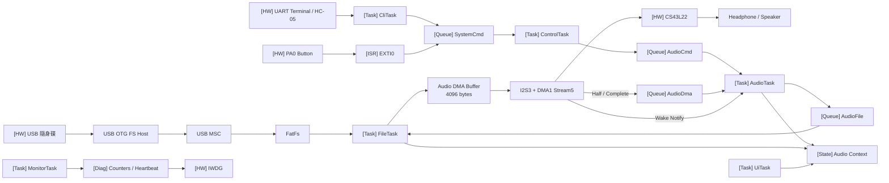

---

## 2. Task Priority 與責任

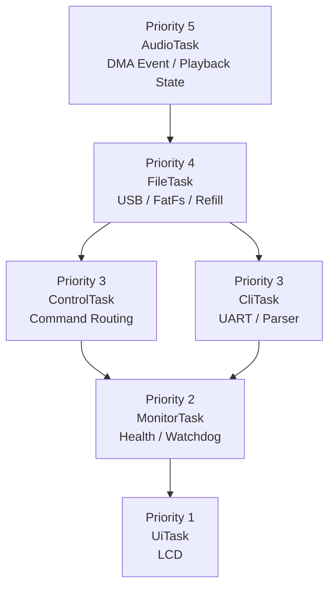

AudioTask 的 priority 高於其他 application tasks。FileTask priority 次之，
目的是讓 DMA boundary 與 FatFs refill 優先於控制、監控與顯示。LCD 更新
週期設定為 500 ms。

---

## 3. 開機流程

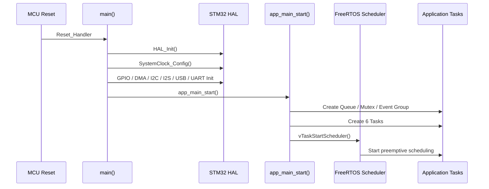

若 object 或 task 建立失敗，系統進入 safe error loop：關閉中斷、關閉
PD12～PD14、點亮 PD15。

---

## 4. USB 插入與開始播放

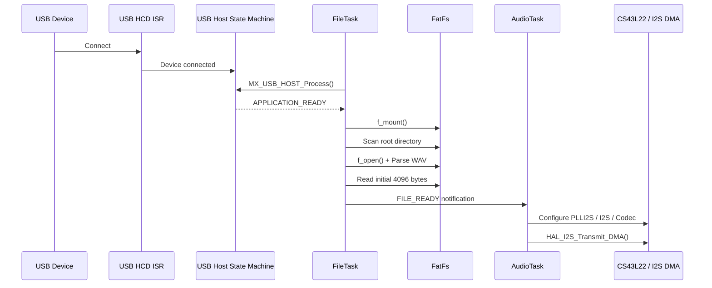

---

## 5. Command Path

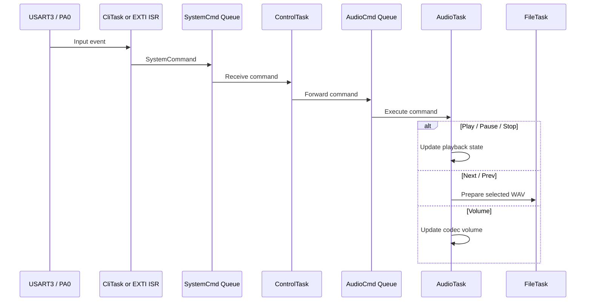

ControlTask 不直接呼叫 codec 或 FatFs。它只負責把不同輸入來源轉成一致的
command flow。

---

## 6. UART Receive-to-Idle DMA

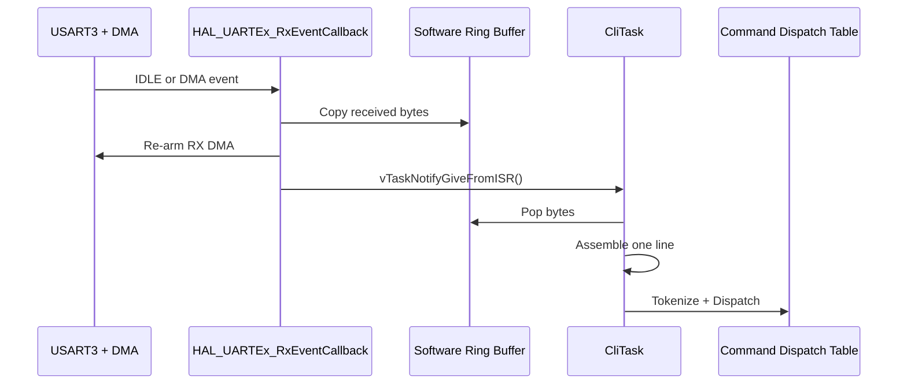

UART Error Callback：

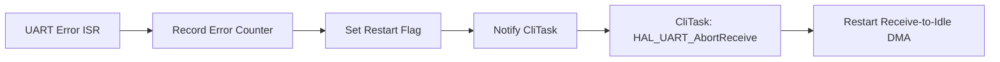

Abort 與 DMA restart 在 CliTask 執行，不在 ISR 內進行。

---

## 7. DMA Ping-pong Buffer

```text
audio_dma_buffer[4096]
┌──────────────────────────────┐
│ Half 0：2048 bytes           │
├──────────────────────────────┤
│ Half 1：2048 bytes           │
└──────────────────────────────┘
```

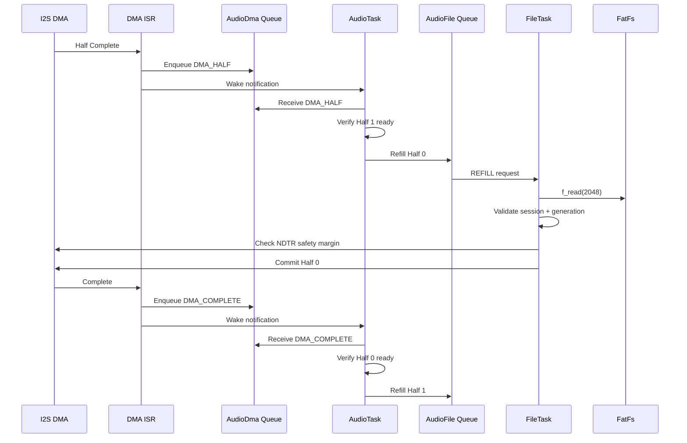

44.1 kHz、16-bit Stereo：

```text
Bytes per frame = 2 channels × 2 bytes = 4 bytes
Frames per half = 2048 / 4 = 512 frames
Half-buffer time = 512 / 44100 ≈ 11.6 ms
```

---

## 8. Underrun 處理

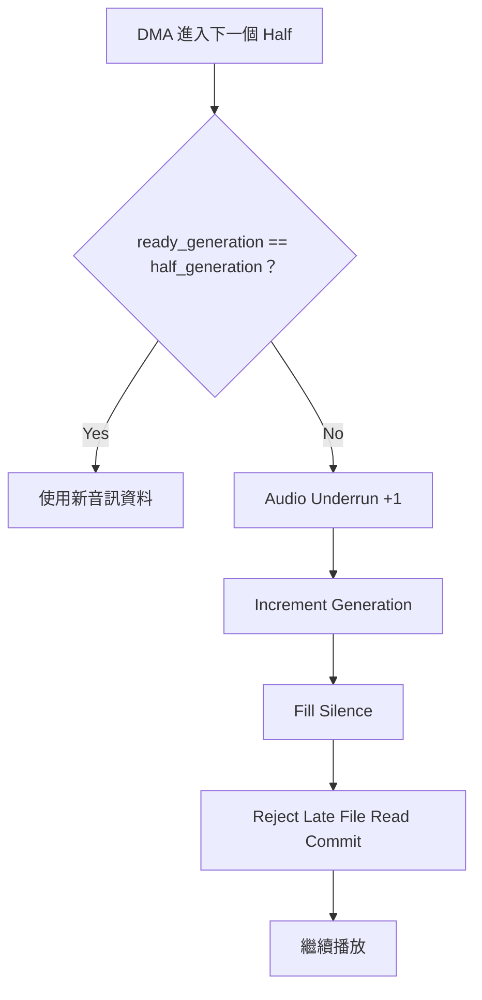

Generation 用來拒絕逾時的 `f_read()` commit；`NDTR` 安全餘量檢查用來
阻止 FileTask 在 DMA 即將切換 half-buffer 時開始 commit。

---

## 9. 切歌與 Stream Session

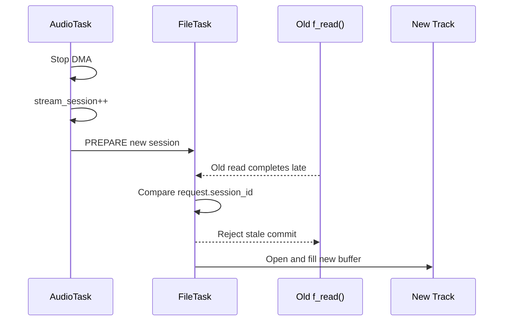

Stop、Next、Prev 與 USB disconnect 都會更新 session。舊 session 不能修改：

- DMA buffer
- Data remaining
- EOF state
- Ready generation

---

## 10. USB 拔除與恢復

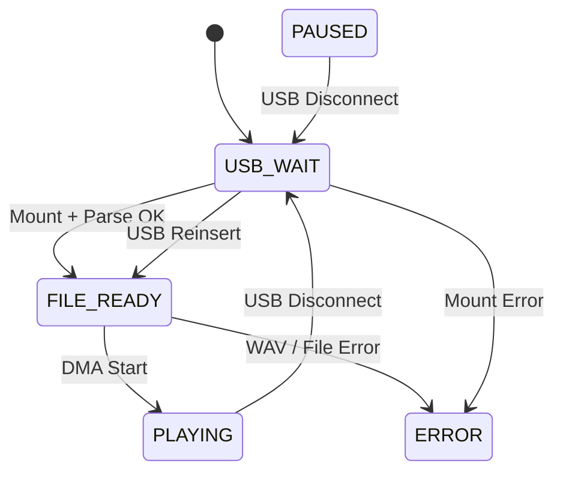

拔除 USB 時：

1. FileTask 關閉檔案。
2. Unmount FatFs。
3. 清空 AudioFile Queue。
4. 清除檔案清單。
5. AudioTask 停止 I2S DMA。
6. 狀態回到 `USB_WAIT`。

---

## 11. Diagnostics 與 Watchdog

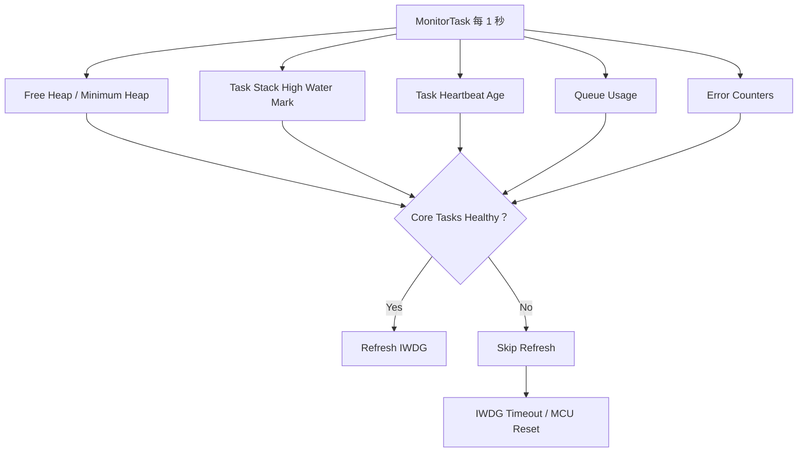

各 Task 不自行 refresh IWDG。MonitorTask 依 heartbeat 與 fatal state 決定
是否 refresh；實際 reset 時間仍受 LSI 誤差影響。

---

## 12. Error Path

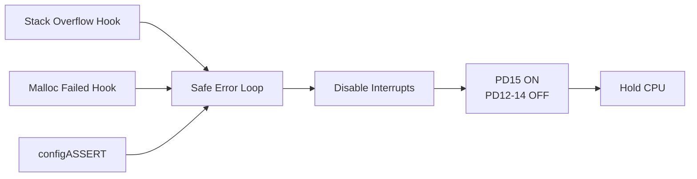

一般可恢復錯誤使用 diagnostics counter；Stack Overflow、Malloc Failed 與
Assert 屬於 fatal error，進入固定錯誤狀態。

---

## 13. RTOS Objects 對照

| Object | Producer | Consumer | 資料 |
|---|---|---|---|
| SystemCmd Queue | CliTask、EXTI ISR | ControlTask | `SystemCommand` |
| AudioCmd Queue | ControlTask | AudioTask | `SystemCommand` |
| AudioFile Queue | AudioTask | FileTask | Prepare / Refill / Close |
| AudioDma Queue | I2S DMA ISR | AudioTask | Half / Complete / Error |
| Task Notification | I2S DMA ISR | AudioTask | Wake-up |
| Task Notification | UART ISR | CliTask | RX data ready |
| Mutex | AudioTask、FileTask | CLI、UI、Monitor | Audio context |
| Event Group | AudioTask、FileTask | System modules | USB / File / Play state |

---

## 14. 設計要點

1. DMA ISR 只送 queue event 與 notification，不執行 FatFs、LCD 或 UART output。
2. FileTask 是 FatFs 操作的單一 owner。
3. AudioTask 是 codec 與播放狀態的單一 owner。
4. Queue 保留 command 與 DMA event；Task Notification 負責快速喚醒 Task。
5. Generation 偵測 half-buffer deadline miss。
6. Stream Session 阻擋跨歌曲的 stale read。
7. MonitorTask 統一判斷 health 並 refresh Watchdog。
8. CLI 提供 Heap、Stack、Queue、Buffer 與 Error Counter。
