# USB_MP3 程式碼圖解

這份只看程式碼，不拿既有文件來補腦。先講一個容易誤會的地方：專案名稱是 `USB_MP3`，但程式碼實際掃的是 `wav` / `WAV`，也用 `WAVE_FormatTypeDef` 讀 WAV header，沒有看到 MP3 解碼流程。

讀這包程式時，可以先抓三個重點：

1. `main()` 負責等 USB 隨身碟 ready、掛載檔案系統、啟動播放器。
2. `waveplayer.c` 負責找 WAV、讀檔、補 buffer、處理播放狀態。
3. `AUDIO.c`、`cs43l22.c`、`AUDIO_LINK.c` 負責把 buffer 送到 I2S DMA，再透過 codec 發出聲音。

## 01. 一眼看懂整個專案

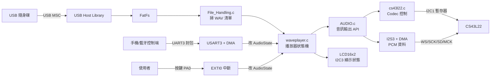

## 02. 程式分層

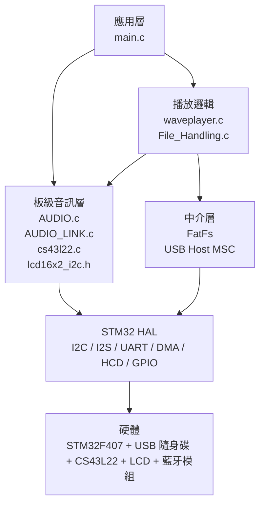

## 03. 主要檔案分工

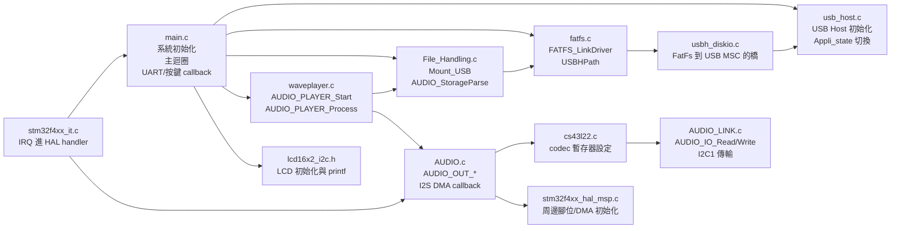

## 04. 上電到主迴圈的順序

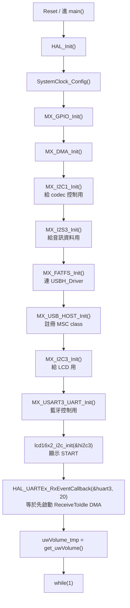

## 05. 主迴圈在等什麼

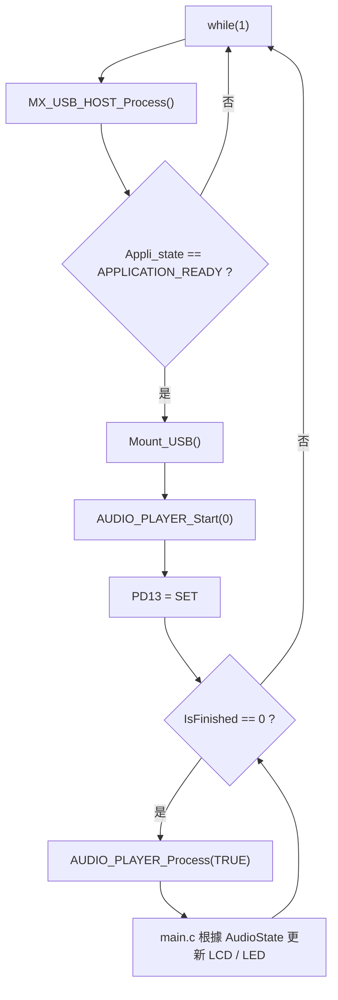

## 06. USB Host 狀態怎麼進 main

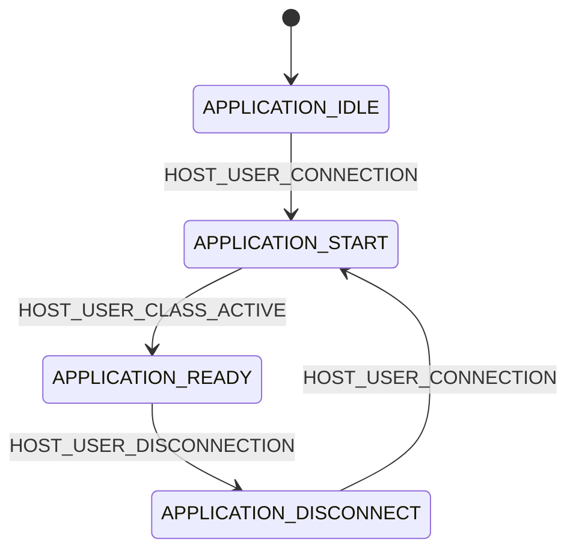

`Appli_state` 是 `usb_host.c` 的全域變數，`main.c` 只看它是不是 `APPLICATION_READY`。真正切換是在 `USBH_UserProcess()` callback。

## 07. USB 隨身碟讀檔路線

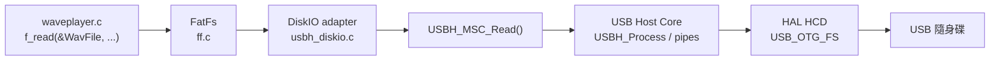

## 08. 掃 WAV 清單

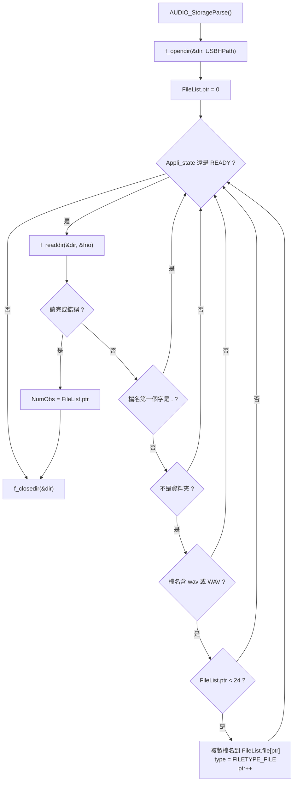

## 09. 播第一首的時序

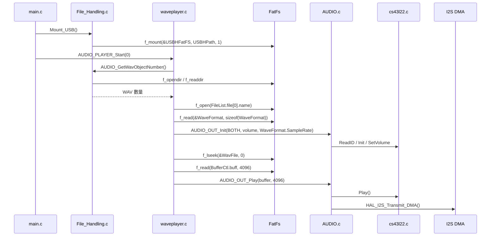

## 10. 音訊資料流

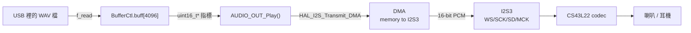

## 11. 4096 bytes buffer 怎麼輪流補

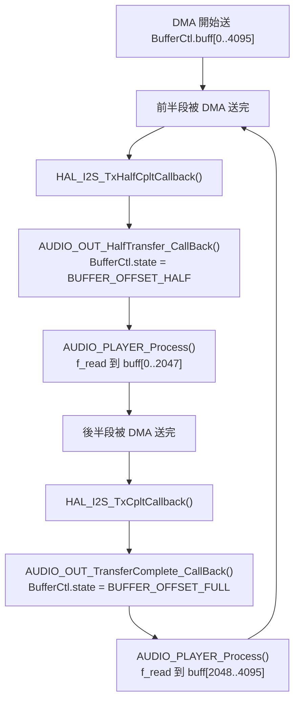

## 12. DMA callback 和主迴圈的關係

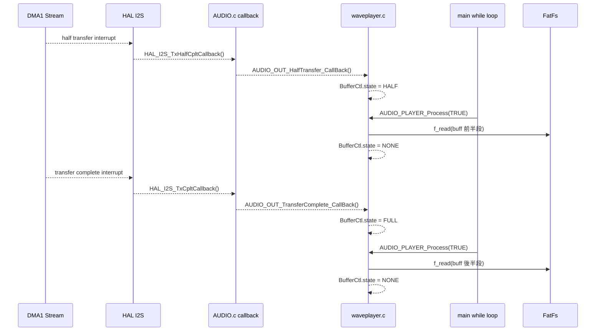

## 13. 播放狀態機總圖

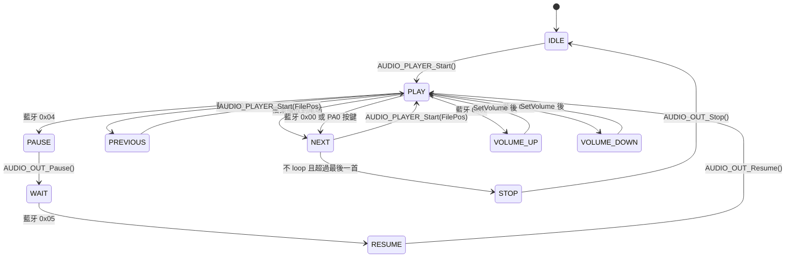

`main.c` 呼叫 `AUDIO_PLAYER_Process(TRUE)`，所以正常播到最後一首時，`NEXT` 會繞回第 0 首，不會自己停。`STOP` 主要是程式其他地方把 `AudioState` 設成 stop 才會走到。

## 14. `AUDIO_PLAYER_Process(TRUE)` 的分支

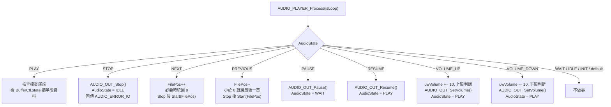

## 15. 下一首流程

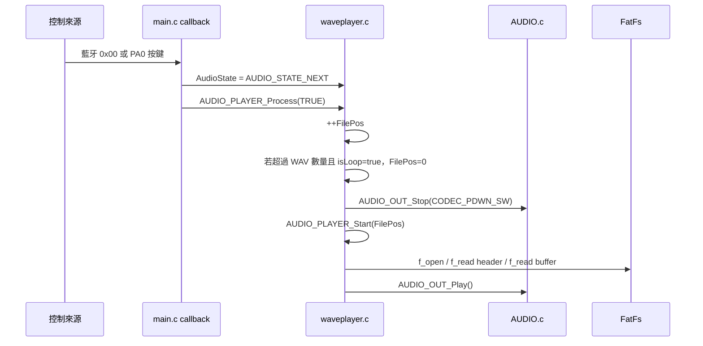

## 16. 暫停與恢復

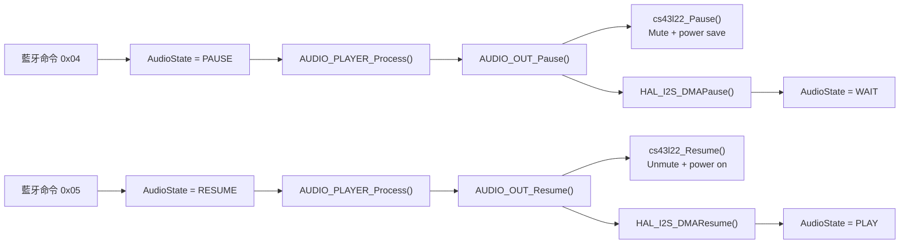

## 17. 音量控制

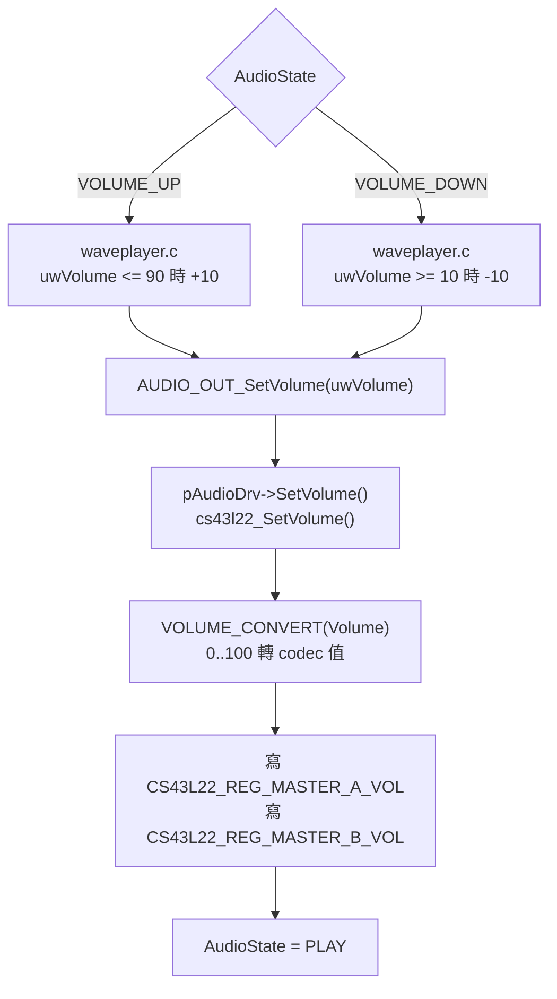

`main.c` 另外有一個 `uwVolume_tmp` 只拿來顯示 LCD，不是 codec 真正音量來源。真正送到 codec 的是 `waveplayer.c` 裡面的 static `uwVolume`。

## 18. 藍牙 UART 封包怎麼變成動作

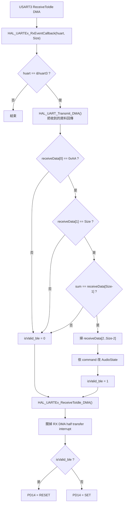

照目前程式碼，`sum` 被設成 0，累加那段被註解掉，所以封包最後一個 byte 要是 0，才會進到 command switch。

## 19. 藍牙命令對照

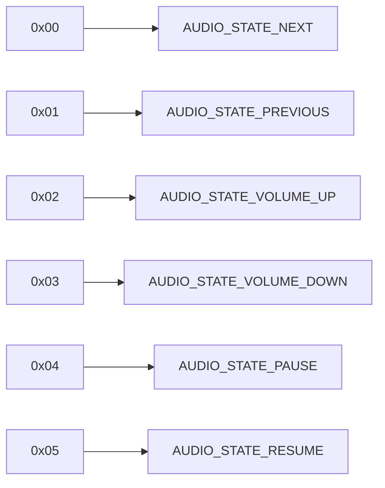

## 20. 按鍵訊號路徑

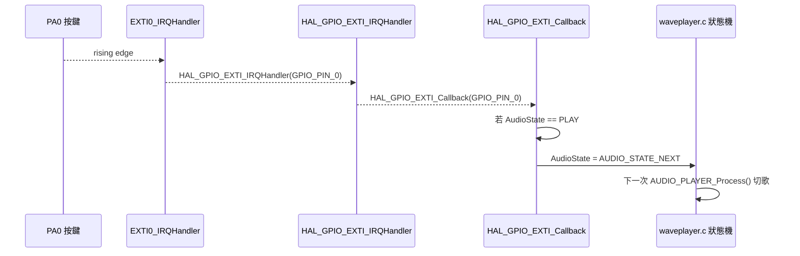

## 21. LCD 顯示不是主流程，只是狀態提示

```mermaid
flowchart TD
    LCDInit["lcd16x2_i2c_init(&hi2c3) 成功"] --> StartText["顯示 START / NCKU Team-14"]
    StartText --> LED12["PD12 = SET"]
    Playing["播放中主迴圈"] --> WatchState{"main.c 看到 AudioState"}
    WatchState -->|"STOP"| EndText["顯示 END<br/>PD12/PD13/PD14 reset<br/>IsFinished=1"]
    WatchState -->|"VOLUME_UP"| UpText["顯示 VOLUME_UP 和 uwVolume_tmp"]
    WatchState -->|"VOLUME_DOWN"| DownText["顯示 VOLUME_DOWN 和 uwVolume_tmp"]
    WatchState -->|"RESUME"| ResumeText["顯示 RESUME 和 uwVolume_tmp"]
    WatchState -->|"PAUSE"| PauseText["顯示 PAUSE"]
```

## 22. I2C 兩條線各做各的事

```mermaid
flowchart LR
    subgraph I2C1["I2C1: codec 控制"]
        PB6["PB6 SCL"] --> CodecBus["AUDIO_LINK.c"]
        PB9["PB9 SDA"] --> CodecBus
        CodecBus --> CS43["CS43L22 暫存器"]
    end

    subgraph I2C3["I2C3: LCD 控制"]
        PA8["PA8 SCL"] --> LCDBus["lcd16x2_i2c.h"]
        PC9["PC9 SDA"] --> LCDBus
        LCDBus --> LCD["LCD16x2"]
    end
```

## 23. I2S 音訊腳位

```mermaid
flowchart LR
    DMA["DMA buffer"] --> I2S3["SPI3 / I2S3 Master TX"]
    I2S3 --> PA4["PA4 I2S3_WS"]
    I2S3 --> PC7["PC7 I2S3_MCK"]
    I2S3 --> PC10["PC10 I2S3_CK"]
    I2S3 --> PC12["PC12 I2S3_SD"]
    PA4 --> Codec["CS43L22"]
    PC7 --> Codec
    PC10 --> Codec
    PC12 --> Codec
```

## 24. 其他 GPIO 與 DMA

```mermaid
flowchart TB
    PC0["PC0<br/>USB VBUS 開關"] --> VBUS["MX_DriverVbusFS()"]
    PA0["PA0<br/>EXTI rising"] --> Button["切下一首"]
    PD12["PD12"] --> LEDStart["LCD init 成功 / 播放結束時關"]
    PD13["PD13"] --> LEDPlay["開始播放時亮"]
    PD14["PD14"] --> LEDBle["藍牙封包錯誤亮<br/>正確關"]
    PD15["PD15"] --> LEDUnused["程式碼有初始化<br/>目前沒看到使用"]

    DMA1S1["DMA1 Stream1"] --> UARTRX["USART3 RX"]
    DMA1S3["DMA1 Stream3"] --> UARTTX["USART3 TX"]
    DMA1S5["DMA1 Stream5"] --> I2STX["SPI3 TX / I2S3 TX"]
```

## 25. 中斷總表

```mermaid
flowchart TD
    EXTI0["EXTI0_IRQHandler"] --> GPIOHAL["HAL_GPIO_EXTI_IRQHandler"]
    GPIOHAL --> ButtonCB["HAL_GPIO_EXTI_Callback in main.c"]

    DMA1S1["DMA1_Stream1_IRQHandler"] --> UARTRXHAL["HAL_DMA_IRQHandler(&hdma_usart3_rx)"]
    USART3["USART3_IRQHandler"] --> UARTHAL["HAL_UART_IRQHandler(&huart3)"]
    UARTHAL --> UARTCB["HAL_UARTEx_RxEventCallback in main.c"]

    DMA1S3["DMA1_Stream3_IRQHandler"] --> UARTTXHAL["HAL_DMA_IRQHandler(&hdma_usart3_tx)"]
    DMA1S5["DMA1_Stream5_IRQHandler"] --> I2SHAL["HAL_DMA_IRQHandler(&hdma_spi3_tx)"]
    I2SHAL --> I2SCB["HAL_I2S_TxHalfCpltCallback / TxCpltCallback in AUDIO.c"]

    OTG["OTG_FS_IRQHandler"] --> HCD["HAL_HCD_IRQHandler"]
    HCD --> USBHCB["USBH_LL_* callbacks"]

    I2C3EV["I2C3_EV_IRQHandler"] --> I2C3HAL["HAL_I2C_EV_IRQHandler(&hi2c3)"]
    I2C3ER["I2C3_ER_IRQHandler"] --> I2C3ERR["HAL_I2C_ER_IRQHandler(&hi2c3)"]
```

## 26. Codec 初始化順序

```mermaid
sequenceDiagram
    participant Wave as waveplayer.c
    participant Audio as AUDIO.c
    participant AudioLink as AUDIO_LINK.c
    participant Codec as cs43l22.c
    participant I2C as I2C1 HAL
    participant CS43 as CS43L22

    Wave->>Audio: PlayerInit(WaveFormat.SampleRate)
    Audio->>Audio: AUDIO_OUT_ClockConfig()
    Audio->>Audio: I2S3_Init(AudioFreq)

    Audio->>Codec: cs43l22_drv.ReadID(AUDIO_I2C_ADDRESS)
    Codec->>AudioLink: AUDIO_IO_Init()
    AudioLink->>I2C: I2Cx_Init()
    AudioLink->>CS43: Reset pin OFF then ON

    Codec->>AudioLink: AUDIO_IO_Read(CHIPID)
    AudioLink->>I2C: HAL_I2C_Mem_Read()

    Audio->>Codec: Init(address, BOTH, volume, freq)
    Codec->>AudioLink: AUDIO_IO_Write(reg, value)
    AudioLink->>I2C: HAL_I2C_Mem_Write()
```

## 27. `AUDIO_DrvTypeDef` 函式指標

```mermaid
classDiagram
    class AUDIO_DrvTypeDef {
        +Init()
        +DeInit()
        +ReadID()
        +Play()
        +Pause()
        +Resume()
        +Stop()
        +SetFrequency()
        +SetVolume()
        +SetMute()
        +SetOutputMode()
        +Reset()
    }
    class cs43l22_drv {
        +cs43l22_Init
        +cs43l22_DeInit
        +cs43l22_ReadID
        +cs43l22_Play
        +cs43l22_Pause
        +cs43l22_Resume
        +cs43l22_Stop
        +cs43l22_SetVolume
        +cs43l22_SetMute
        +cs43l22_SetOutputMode
    }
    AUDIO_DrvTypeDef <|.. cs43l22_drv
```

這裡的意思很簡單：`AUDIO.c` 不直接寫死 codec 函式名稱，它透過 `pAudioDrv->Play()` 這種入口呼叫。目前接上的 driver 就是 `cs43l22_drv`。

## 28. 重要資料結構

```mermaid
classDiagram
    class AUDIO_OUT_BufferTypeDef {
        +uint8_t buff[4096]
        +BUFFER_StateTypeDef state
        +uint32_t fptr
    }
    class WAVE_FormatTypeDef {
        +uint32_t ChunkID
        +uint32_t FileSize
        +uint32_t FileFormat
        +uint32_t SampleRate
        +uint16_t NbrChannels
        +uint16_t BitPerSample
        +uint32_t SubChunk2Size
    }
    class FILELIST_FileTypeDef {
        +FILELIST_LineTypeDef file[24]
        +uint16_t ptr
    }
    class FILELIST_LineTypeDef {
        +uint8_t type
        +uint8_t name[40]
    }
    FILELIST_FileTypeDef "1" o-- "24" FILELIST_LineTypeDef
```

## 29. 全域變數關係

```mermaid
flowchart LR
    Appli["Appli_state<br/>usb_host.c"] --> MainReady["main.c 判斷可不可以開始播放"]
    AudioState["AudioState<br/>waveplayer.c"] --> MainUI["main.c 顯示 LCD / LED"]
    AudioState --> PlayerSM["AUDIO_PLAYER_Process() 狀態機"]
    FileList["FileList<br/>waveplayer.c"] --> FileScan["File_Handling.c 掃到 WAV 後填入"]
    WaveFormat["WaveFormat<br/>waveplayer.c"] --> AudioFreq["AUDIO_OUT_Init 使用 SampleRate"]
    BufferCtl["BufferCtl<br/>waveplayer.c"] --> DMAFlow["DMA half/full callback 和補資料"]
    WavFile["WavFile<br/>waveplayer.c"] --> FatRead["f_open / f_read / f_close"]
    uwVolume["uwVolume<br/>waveplayer.c static"] --> CodecVol["真正 codec 音量"]
    uwVolumeTmp["uwVolume_tmp<br/>main.c"] --> LCDVol["LCD 顯示用音量"]
```

## 30. API 呼叫圖：從 main 往下

```mermaid
flowchart TD
    Main["main()"] --> Init["MX_* 初始化"]
    Main --> USBProc["MX_USB_HOST_Process()"]
    Main --> Mount["Mount_USB()"]
    Main --> Start["AUDIO_PLAYER_Start(0)"]
    Main --> Process["AUDIO_PLAYER_Process(TRUE)"]
    Main --> LCD["lcd16x2_i2c_*"]

    Start --> Count["AUDIO_GetWavObjectNumber()"]
    Count --> Parse["AUDIO_StorageParse()"]
    Parse --> Dir["f_opendir / f_readdir / f_closedir"]
    Start --> Open["f_open / f_read header / f_lseek / f_read buffer"]
    Start --> PlayerInit["PlayerInit(SampleRate)"]
    PlayerInit --> AudioInit["AUDIO_OUT_Init()"]
    Start --> AudioPlay["AUDIO_OUT_Play()"]

    Process --> AudioStop["AUDIO_OUT_Stop()"]
    Process --> AudioPause["AUDIO_OUT_Pause()"]
    Process --> AudioResume["AUDIO_OUT_Resume()"]
    Process --> AudioVolume["AUDIO_OUT_SetVolume()"]
    Process --> StartAgain["AUDIO_PLAYER_Start(FilePos)"]
```

## 31. API 呼叫圖：音訊輸出往下

```mermaid
flowchart TD
    AudioInit["AUDIO_OUT_Init()"] --> Clock["AUDIO_OUT_ClockConfig()"]
    AudioInit --> Msp["AUDIO_OUT_MspInit() 或 HAL_I2S_MspInit()"]
    AudioInit --> I2SInit["I2S3_Init()"]
    AudioInit --> ReadID["cs43l22_drv.ReadID()"]
    AudioInit --> CodecInit["pAudioDrv->Init()"]

    AudioPlay["AUDIO_OUT_Play()"] --> CodecPlay["pAudioDrv->Play()"]
    AudioPlay --> DMATx["HAL_I2S_Transmit_DMA()"]

    AudioPause["AUDIO_OUT_Pause()"] --> CodecPause["pAudioDrv->Pause()"]
    AudioPause --> DMAPause["HAL_I2S_DMAPause()"]

    AudioResume["AUDIO_OUT_Resume()"] --> CodecResume["pAudioDrv->Resume()"]
    AudioResume --> DMAResume["HAL_I2S_DMAResume()"]

    AudioStop["AUDIO_OUT_Stop()"] --> DMAStop["HAL_I2S_DMAStop()"]
    AudioStop --> CodecStop["pAudioDrv->Stop()"]
```

## 32. FatFs 掛載與 driver 連接

```mermaid
flowchart TD
    FatInit["MX_FATFS_Init()"] --> Link["FATFS_LinkDriver(&USBH_Driver, USBHPath)"]
    Link --> Path["USBHPath 得到邏輯磁碟路徑"]
    Mount["Mount_USB()"] --> FMount["f_mount(&USBHFatFS, USBHPath, 1)"]
    FMount --> Ready["之後 f_opendir / f_open / f_read 才有路徑可走"]
```

## 33. USB Host 底層回呼

```mermaid
flowchart LR
    HCD["HAL HCD / USB_OTG_FS"] --> Connect["HAL_HCD_Connect_Callback"]
    Connect --> LLConnect["USBH_LL_Connect"]
    HCD --> Disconnect["HAL_HCD_Disconnect_Callback"]
    Disconnect --> LLDisconnect["USBH_LL_Disconnect"]
    HCD --> PortOn["HAL_HCD_PortEnabled_Callback"]
    PortOn --> LLPortOn["USBH_LL_PortEnabled"]
    HCD --> PortOff["HAL_HCD_PortDisabled_Callback"]
    PortOff --> LLPortOff["USBH_LL_PortDisabled"]
    USBH["USB Host Library"] --> UserProc["USBH_UserProcess"]
    UserProc --> AppState["Appli_state"]
```

## 34. VBUS 控制

```mermaid
flowchart TD
    USBHLL["USBH_LL_DriverVBUS(phost, state)"] --> Platform["MX_DriverVbusFS(state)"]
    Platform --> Check{"state == 0 ?"}
    Check -- "是" --> High["PC0 = GPIO_PIN_SET"]
    Check -- "否" --> Low["PC0 = GPIO_PIN_RESET"]
```

這段程式碼有特別反相處理：`state == 0` 時把 PC0 拉高，`state != 0` 時拉低。看硬體時要照程式碼，不要只用函式名稱猜。

## 35. 播放一首歌時的時間線

```mermaid
sequenceDiagram
    participant USB as USB 隨身碟
    participant Fat as FatFs
    participant Wave as waveplayer.c
    participant DMA as I2S DMA
    participant Codec as CS43L22

    Wave->>Fat: f_read 4096 bytes 到 buffer
    Fat->>USB: USB MSC read sectors
    Wave->>DMA: HAL_I2S_Transmit_DMA(buffer)
    DMA->>Codec: 送前半段 PCM
    DMA-->>Wave: half callback, state=HALF
    Wave->>Fat: 補前半段
    Fat->>USB: 再讀下一段
    DMA->>Codec: 送後半段 PCM
    DMA-->>Wave: full callback, state=FULL
    Wave->>Fat: 補後半段
    Fat->>USB: 再讀下一段
```

## 36. 檔案播完時

```mermaid
flowchart TD
    Playing["AudioState = PLAY"] --> CheckEnd{"BufferCtl.fptr >= WaveFormat.FileSize ?"}
    CheckEnd -- "否" --> Continue["繼續看 half/full buffer 狀態"]
    CheckEnd -- "是" --> StopOut["AUDIO_OUT_Stop(CODEC_PDWN_SW)"]
    StopOut --> SetNext["AudioState = AUDIO_STATE_NEXT"]
    SetNext --> NextCase["下一次進 NEXT case"]
    NextCase --> Inc["FilePos++"]
    Inc --> Over{"FilePos >= WAV 數量 ?"}
    Over -- "否" --> StartNext["AUDIO_PLAYER_Start(FilePos)"]
    Over -- "是且 isLoop=true" --> Loop0["FilePos = 0<br/>AUDIO_PLAYER_Start(0)"]
    Over -- "是且 isLoop=false" --> StopState["AudioState = STOP"]
```

## 37. 目前程式比較容易踩到的點

```mermaid
flowchart TD
    A["專案名叫 USB_MP3"] --> B["程式碼掃 wav/WAV<br/>沒有 MP3 decoder"]
    C["UART checksum 累加被註解"] --> D["sum 固定 0<br/>封包尾 byte 要是 0 才會有效"]
    E["uwVolume 與 uwVolume_tmp 分開"] --> F["codec 真音量在 waveplayer.c<br/>LCD 顯示值在 main.c"]
    G["AUDIO_GetWavObjectNumber() 沒有失敗 return"] --> H["如果 AUDIO_StorageParse() 失敗<br/>回傳值未明確定義"]
    I["I2S DMA 設定分散"] --> J["main 的 MSP 用 DMA1 Stream5<br/>AUDIO.h 另外有 Stream7 巨集<br/>讀中斷時要看實際 it.c"]
```

這些點不是問題清單，而是讀程式時很容易看歪的地方。先抓住這幾點，後面比較不會繞路。

## 38. 除錯時先看哪裡

```mermaid
flowchart TD
    NoSound["沒有聲音"] --> USBReady{"Appli_state 有到 READY ?"}
    USBReady -- "否" --> CheckUSB["看 USBH_UserProcess / OTG_FS_IRQHandler / VBUS PC0"]
    USBReady -- "是" --> HasWav{"AUDIO_GetWavObjectNumber() > 0 ?"}
    HasWav -- "否" --> CheckFile["確認隨身碟根目錄有 wav/WAV 檔"]
    HasWav -- "是" --> Started{"AUDIO_PLAYER_Start() 回傳 OK ?"}
    Started -- "否" --> CheckHeader["看 f_open / f_read / WaveFormat.SampleRate"]
    Started -- "是" --> DMAIrq{"DMA half/full callback 有跑 ?"}
    DMAIrq -- "否" --> CheckDMA["看 DMA1_Stream5_IRQHandler / HAL_I2S callbacks"]
    DMAIrq -- "是" --> CodecOK{"codec ReadID / Init OK ?"}
    CodecOK -- "否" --> CheckI2C1["看 I2C1 PB6/PB9 / CS43L22 reset PD4"]
    CodecOK -- "是" --> CheckHW["看 I2S 腳位與喇叭/耳機硬體"]
```

## 39. 控制訊號與音訊資料分開看

```mermaid
flowchart LR
    subgraph Control["控制訊號"]
        BLE["藍牙 UART3"] --> AudioStateA["AudioState"]
        Button["PA0 按鍵"] --> AudioStateA
        MainUI["main.c LCD/LED"] --> Display["使用者看得到的狀態"]
    end

    subgraph Data["音訊資料"]
        USBFile["USB WAV file"] --> FatRead["f_read"]
        FatRead --> Buffer["BufferCtl.buff"]
        Buffer --> DMA["I2S DMA"]
        DMA --> Codec["CS43L22"]
        Codec --> Sound["聲音"]
    end

    AudioStateA --> Player["AUDIO_PLAYER_Process()"]
    Player --> FatRead
    Player --> DMA
    Player --> Codec
```

## 40. 5 分鐘講解這個專案

這段整理成五分鐘版本，重點放在流程和資料怎麼走，不需要一開始就背所有函式。

### 第 0:00 到 0:40，先講總圖

用第 01 張圖開場：

> 整體可以看成 USB WAV 播放器。USB 隨身碟提供檔案，FatFs 負責檔案系統，`waveplayer.c` 把 WAV 讀進 buffer，`AUDIO.c` 用 I2S DMA 丟給 CS43L22 codec。藍牙和按鍵的角色是改 `AudioState`，播放動作由狀態機接手處理。

### 第 0:40 到 1:30，講啟動順序

看第 04、05、06 張圖：

> 上電後 `main()` 先初始化 GPIO、DMA、I2C、I2S、FatFs、USB Host、UART、LCD。進入 while loop 後，每圈都跑 `MX_USB_HOST_Process()`。USB Host callback 把 `Appli_state` 改成 `APPLICATION_READY` 之後，主程式才掛載 USB、啟動第 0 首。

### 第 1:30 到 2:40，講音訊資料怎麼流

看第 07、10、11、12、35 張圖：

> 播放時不會把整首歌一次塞進 RAM。程式主要靠一個 4096 bytes buffer 輪流補資料。DMA 送前半段時，CPU 等 callback 標記前半段送完，再把前半段補成新資料；後半段也是同樣做法。資料路線是 `f_read()`、FatFs、USB MSC、buffer、I2S DMA、CS43L22、喇叭。

### 第 2:40 到 3:35，講控制怎麼進來

看第 13、18、19、20 張圖：

> 藍牙 UART 收到封包後，callback 主要把 command 轉成 `AudioState`，例如 0x00 是下一首、0x04 是暫停。PA0 按鍵也是同一個概念，播放中按下去就把狀態改成下一首。切歌、暫停、調音量都集中在 `AUDIO_PLAYER_Process()` 裡處理。

### 第 3:35 到 4:25，講 codec 和周邊

看第 22、23、24、25、26、31 張圖：

> I2C1 是 codec 控制，寫 CS43L22 暫存器；I2C3 是 LCD；I2S3 是音訊資料。UART3 接藍牙，USB OTG FS 接隨身碟。中斷進來後大多先進 HAL handler，再回到我們自己的 callback。

### 第 4:25 到 5:00，補接手注意事項

看第 37、38、39 張圖：

> 專案名稱是 `USB_MP3`，但目前程式碼走的是 WAV 播放流程。藍牙 checksum 目前 `sum` 沒累加，所以封包尾端要配合現況。音量有兩份變數，真正送 codec 的在 `waveplayer.c`，LCD 顯示的是 `main.c` 的暫存值。除錯可以照第 38 張圖：先看 USB ready，再看 WAV 清單，再看 DMA callback，最後看 codec 和硬體。

五分鐘內抓住三件事就夠了：程式從哪裡開始跑、音訊資料怎麼不斷被補進 DMA、控制命令最後怎麼改變播放器狀態。
